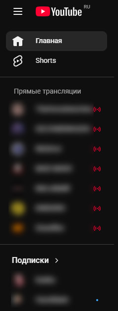

# YouTube Livestream Section

The plugin adds a **“Live Streams”** block to the YouTube sidebar, displaying channels from your subscriptions that are currently streaming live.

---

## Features

- 🔴 shows channels that are currently live  
- ❤️ supports all interface languages  
- 📌 separate **Live Streams** section  
- 🧩 lightweight and does not require external APIs  

---

## Installation

### Via Releases

Download the latest version:

https://github.com/drnkwtr/youtube-livestream-section/releases/latest

### Or directly from the source code

https://github.com/drnkwtr/youtube-livestream-section/archive/refs/heads/main.zip

### Installation Instructions

1. Extract the archive  
2. Open `chrome://extensions`  
3. Enable **Developer Mode**  
4. Click **Load unpacked**  
5. Select the extension folder  

---

# YouTube Livestream Section

Плагин добавляет в боковую панель YouTube блок **«Прямые трансляции»**, где отображаются каналы из подписок, которые сейчас ведут стрим.

---

## Возможности

- 🔴 показывает стримящие каналы
- ❤️ поддержка всех языков интерфейса
- 📌 отдельный блок **Прямые трансляции**
- 🧩 лёгкий и без внешних API

---

## Установка

### Через Releases

Скачайте последнюю версию:

https://github.com/drnkwtr/youtube-livestream-section/releases/latest

### Или напрямую через исходный код

https://github.com/drnkwtr/youtube-livestream-section/archive/refs/heads/main.zip

### Инструкция по установке

1. Распакуйте архив
2. Откройте `chrome://extensions`
3. Включите **Режим разработчика**
4. Нажмите **Загрузить распакованное расширение**
5. Выберите папку расширения

---

## License

MIT
